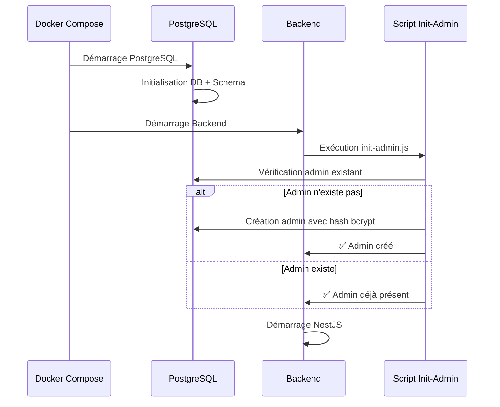

# 🐳 Guide de Déploiement Docker avec Initialisation Automatique de l'Admin

## 📋 Processus de Déploiement

### 1. **Préparation des Variables d'Environnement**

Assurez-vous que votre fichier `.env` contient :

```env
# Configuration Admin
DEFAULT_ADMIN_EMAIL=admin@mandat.com
DEFAULT_ADMIN_PASSWORD=admincimandat20_25

# Configuration Base de Données
DATABASE_URL=postgresql://ci_mandat_user:CiMandatProd2024SecureDBPass@ci_mandat_postgres_prod:5432/ci_mandat_db
```

### 2. **Séquence de Démarrage Docker**



### 3. **Commandes de Déploiement**

#### Déploiement Complet :
```bash
# Arrêt des conteneurs existants
docker compose down

# Nettoyage (optionnel)
docker system prune -f

# Build et démarrage
docker compose up --build
```

#### Déploiement Rapide :
```bash
# Redémarrage simple
docker compose restart

# Ou reconstruction
docker compose up --build -d
```

### 4. **Vérification du Processus**

#### Vérifier les logs :
```bash
# Voir tous les logs
docker compose logs

# Voir uniquement le backend
docker compose logs backend

# Suivre les logs en temps réel
docker compose logs -f backend
```

#### Logs attendus :
```
ci_mandat_backend  | 🚀 Initialisation du compte administrateur...
ci_mandat_backend  | ✅ Compte administrateur créé avec succès
ci_mandat_backend  | 📧 Email: admin@mandat.com
ci_mandat_backend  | 🔑 Mot de passe: [CONFIGURÉ DANS LES VARIABLES D'ENVIRONNEMENT]
ci_mandat_backend  | 👤 Rôle: super_admin
ci_mandat_backend  | 📊 Statut: active
ci_mandat_backend  | [Nest] Starting Nest application...
```

### 5. **Commandes de Dépannage**

#### Vérifier l'état des conteneurs :
```bash
docker compose ps

# Output attendu :
# NAME                  COMMAND                  SERVICE             STATUS              PORTS
# ci_mandat_postgres    "docker-entrypoint.s…"   postgres            running             0.0.0.0:5432->5432/tcp
# ci_mandat_backend     "/usr/bin/dumb-init …"   backend             running             0.0.0.0:3001->3001/tcp
```

#### Exécution manuelle du script :
```bash
# Si besoin de forcer l'initialisation
docker exec -it ci_mandat_backend npm run init:admin
```

#### Vérifier la base de données :
```bash
# Se connecter à PostgreSQL
docker exec -it ci_mandat_postgres psql -U ci_mandat_user -d ci_mandat_db

# Vérifier l'utilisateur admin
SELECT email, role, status FROM users WHERE role = 'super_admin';
```

### 6. **Scénarios de Déploiement**

#### Premier Déploiement :
1. Base de données vide
2. Script détecte l'absence d'admin
3. Création automatique de l'admin
4. Démarrage de l'application

#### Déploiement Subséquent :
1. Base de données avec admin existant
2. Script détecte l'admin existant
3. Aucune action (idempotent)
4. Démarrage direct de l'application

#### Redéploiement après Incident :
1. Même comportement que déploiement subséquent
2. Aucun impact sur les données existantes

### 7. **Variables d'Environnement Critiques**

| Variable | Description | Valeur par défaut |
|----------|-------------|-------------------|
| `DEFAULT_ADMIN_EMAIL` | Email de l'admin | `admin@mandat.com` |
| `DEFAULT_ADMIN_PASSWORD` | Mot de passe admin | `admincimandat20_25` |
| `DATABASE_URL` | URL de connexion PostgreSQL | URL de production |

### 8. **Sécurité et Bonnes Pratiques**

- ✅ **Hash sécurisé** : bcrypt avec 12 rounds
- ✅ **Idempotence** : Pas de doublons d'admin
- ✅ **Variables d'environnement** : Pas de mots de passe en dur
- ✅ **Logs sécurisés** : Pas d'affichage du mot de passe en clair

### 9. **Monitoring en Production**

#### Health Checks :
```bash
# Vérifier la santé du backend
curl http://localhost:3001/api/v1/health

# Vérifier la base de données
docker exec ci_mandat_postgres pg_isready -U ci_mandat_user -d ci_mandat_db
```

#### Alertes :
- Surveiller les logs pour "❌ Erreur lors de l'initialisation"
- Vérifier que l'admin existe après chaque déploiement

## 🎯 Résultat Final

Avec cette solution, **plus aucun problème de longueur de hash bcrypt** lors des déploiements Docker. Le processus est :

- **✅ Automatique** - S'exécute à chaque démarrage
- **✅ Robuste** - Gère tous les scénarios
- **✅ Sécurisé** - Utilise les bonnes pratiques
- **✅ Maintenable** - Facile à dépanner et monitorer