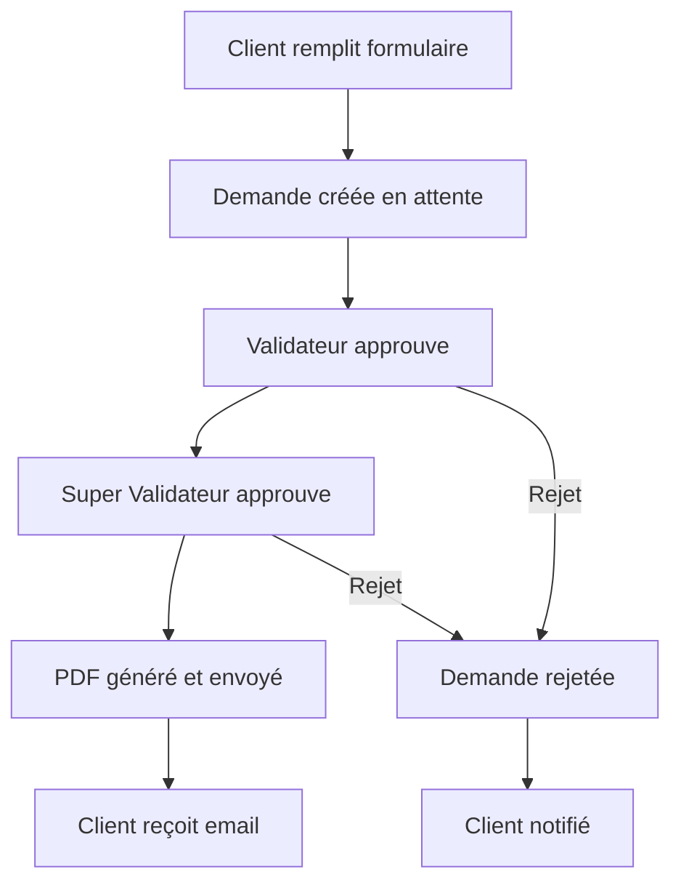

# Projet de Gestion de Mandats Sécurisée

## Architecture du Système

### Stack Technologique
- **Frontend**: Next.js 15.5.4 (React 19.1.0) - Interface utilisateur
- **Backend**: NestJS - API REST sécurisée
- **Base de données**: PostgreSQL avec TypeORM
- **Authentification**: JWT + Refresh Tokens + 2FA
- **Sécurité**: Helmet, CORS, Rate Limiting, CSRF Protection
- **Email**: Nodemailer avec templates
- **PDF**: Puppeteer/PDFKit pour génération sécurisée

### Structure du Projet
```
ci_mandat/
├── frontend/                    # Application Next.js existante
│   ├── src/
│   │   ├── app/
│   │   │   ├── client/          # Interface client
│   │   │   ├── admin/           # Interface administrateur
│   │   │   ├── super-admin/     # Interface super administrateur
│   │   │   └── auth/            # Authentification
│   │   └── components/          # Composants réutilisables
├── backend/                     # Nouvelle API NestJS
│   ├── src/
│   │   ├── modules/
│   │   │   ├── auth/            # Authentification
│   │   │   ├── users/           # Gestion utilisateurs
│   │   │   ├── mandates/        # Gestion des mandats
│   │   │   ├── validation/      # Processus de validation
│   │   │   └── email/           # Service d'email
│   │   ├── guards/              # Guards de sécurité
│   │   ├── interceptors/        # Intercepteurs
│   │   └── decorators/          # Décorateurs personnalisés
└── database/                    # Scripts PostgreSQL
    ├── migrations/
    └── seeds/
```

## Rôles et Permissions

### 1. Client
- Remplir le formulaire de mandat
- Consulter le statut de sa demande
- Recevoir des notifications par email

### 2. Validateur (Admin)
- Voir les demandes en attente
- Approuver/rejeter les demandes
- Consulter l'historique des validations

### 3. Super Validateur (Super Admin)
- Toutes les permissions du validateur
- Créer de nouvelles demandes via l'interface
- Gérer les utilisateurs (créer/modifier/supprimer)
- Accéder aux statistiques et rapports

## Flux de Travail



## Modèles de Données PostgreSQL

### Table `users`
```sql
id: UUID (Primary Key)
email: VARCHAR(255) UNIQUE
password_hash: VARCHAR(255)
role: ENUM('client', 'admin', 'super_admin')
is_active: BOOLEAN
two_factor_secret: VARCHAR(255)
last_login: TIMESTAMP
created_at: TIMESTAMP
updated_at: TIMESTAMP
```

### Table `mandates`
```sql
id: UUID (Primary Key)
client_id: UUID (Foreign Key)
title: VARCHAR(255)
description: TEXT
status: ENUM('pending', 'approved', 'rejected', 'completed')
data: JSONB  -- Données flexibles du formulaire
admin_approver_id: UUID (Foreign Key)
super_admin_approver_id: UUID (Foreign Key)
admin_approved_at: TIMESTAMP
super_admin_approved_at: TIMESTAMP
pdf_generated: BOOLEAN
pdf_url: VARCHAR(500)
created_at: TIMESTAMP
updated_at: TIMESTAMP
```

### Table `audit_logs`
```sql
id: UUID (Primary Key)
user_id: UUID (Foreign Key)
action: VARCHAR(100)
resource_type: VARCHAR(50)
resource_id: UUID
old_values: JSONB
new_values: JSONB
ip_address: INET
user_agent: TEXT
created_at: TIMESTAMP
```

## Mesures de Sécurité Avancées

### 1. Authentification et Autorisation
- JWT avec expiration courte (15 minutes)
- Refresh tokens avec rotation
- Authentification à deux facteurs (2FA)
- Validation des rôles avec guards NestJS
- Sessions sécurisées avec HttpOnly cookies

### 2. Protection des Données
- Chiffrement des données sensibles au repos
- Hachage des mots de passe avec bcrypt
- Validation stricte des entrées utilisateur
- Protection contre les injections SQL
- Sanitisation XSS

### 3. Sécurité Réseau
- Rate limiting par IP et utilisateur
- Protection CSRF
- Headers de sécurité (Helmet)
- CORS configuré strictement
- Validation des uploads de fichiers

### 4. Monitoring et Audit
- Logs détaillés de toutes les actions
- Détection d'activités suspectes
- Alertes de sécurité
- Backup automatique des données

## API Endpoints Sécurisés

### Authentification
- `POST /auth/login` - Connexion avec 2FA
- `POST /auth/refresh` - Rafraîchissement token
- `POST /auth/logout` - Déconnexion
- `POST /auth/2fa/setup` - Configuration 2FA

### Mandats
- `POST /mandates` - Créer un mandat (client)
- `GET /mandates` - Lister les mandats (selon rôle)
- `GET /mandates/:id` - Voir un mandat
- `PATCH /mandates/:id/approve` - Approuver (admin/super admin)
- `PATCH /mandates/:id/reject` - Rejeter (admin/super admin)

### Administration
- `GET /admin/users` - Lister utilisateurs (super admin)
- `POST /admin/users` - Créer utilisateur (super admin)
- `GET /admin/stats` - Statistiques (super admin)

## Interface Utilisateur

### Pages Client
- `/client/dashboard` - Tableau de bord client
- `/client/mandates/new` - Nouveau mandat
- `/client/mandates/:id` - Détail mandat
- `/client/profile` - Profil utilisateur

### Pages Admin
- `/admin/dashboard` - Tableau de bord admin
- `/admin/mandates/pending` - Mandats en attente
- `/admin/mandates/history` - Historique

### Pages Super Admin
- `/super-admin/dashboard` - Tableau de bord complet
- `/super-admin/users` - Gestion utilisateurs
- `/super-admin/stats` - Statistiques avancées
- `/super-admin/mandates/create` - Création directe

## Génération et Envoi de PDF

### Processus
1. Validation complète du mandat
2. Génération du PDF avec Puppeteer
3. Stockage sécurisé (S3 ou système de fichiers)
4. Envoi par email avec lien sécurisé
5. Log de l'envoi pour audit

### Template PDF
- En-tête avec logo et informations
- Détails du mandat validé
- Signatures numériques
- QR code pour vérification
- Date et heure de génération

## Déploiement et Production

### Environnements
- **Development**: Docker Compose
- **Staging**: Vercel (Frontend) + Railway (Backend)
- **Production**: VPS sécurisé avec reverse proxy

### Sécurité Production
- Certificats SSL/TLS
- Firewall applicatif
- Monitoring 24/7
- Sauvegardes automatiques
- Mises à jour de sécurité

## Prochaines Étapes

1. **Setup Backend NestJS** - Configuration initiale
2. **Base de données** - Modèles et migrations
3. **Authentification** - Système de sécurité
4. **API Mandats** - Endpoints CRUD
5. **Interface Admin** - Dashboard et gestion
6. **Génération PDF** - Service d'email
7. **Tests et Sécurité** - Validation complète
8. **Déploiement** - Mise en production

Ce document servira de référence pour le développement de l'application sécurisée de gestion de mandats.