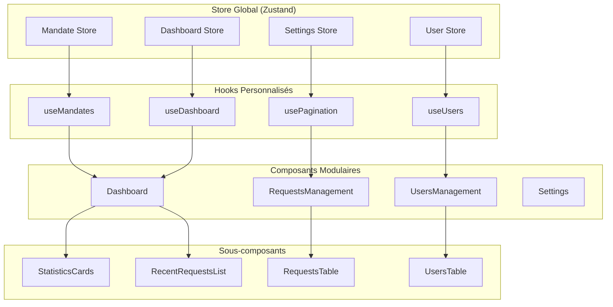

# Plan de Refactoring - Application CI Mandat

## Analyse de l'État Actuel

### Problèmes Identifiés

1. **Composants volumineux**
   - `Dashboard.tsx` : 356 lignes
   - `RequestsManagement.tsx` : 854 lignes
   - Logique métier mélangée avec UI

2. **Gestion d'État limitée**
   - Pas de store global
   - Logique d'état répétée dans les composants
   - Difficulté de partage d'état entre composants

3. **Absence de lazy loading**
   - Tous les composants chargés au démarrage
   - Impact sur les performances initiales

4. **Pagination basique**
   - Pagination client-side inefficace
   - Pas de virtualisation pour les grandes listes

## Architecture Proposée



## Plan de Mise en Œuvre

### Phase 1 : Infrastructure et Gestion d'État

#### 1.1 Installation de Zustand
```bash
npm install zustand
```

#### 1.2 Création des Stores
- `stores/mandate.store.ts` : Gestion des mandats
- `stores/user.store.ts` : Gestion des utilisateurs
- `stores/dashboard.store.ts` : Données du dashboard
- `stores/settings.store.ts` : Paramètres

#### 1.3 Hooks Personnalisés
- `hooks/useMandates.ts` : Logique des mandats
- `hooks/useUsers.ts` : Logique des utilisateurs
- `hooks/useDashboard.ts` : Données dashboard
- `hooks/usePagination.ts` : Pagination avancée

### Phase 2 : Refactoring des Composants

#### 2.1 Dashboard.tsx (356 → ~150 lignes)
**Nouvelle structure :**
```
Dashboard/
├── Dashboard.tsx (conteneur principal)
├── StatisticsCards.tsx (cartes de statistiques)
├── RecentRequestsList.tsx (liste des demandes récentes)
└── DashboardLoading.tsx (état de chargement)
```

#### 2.2 RequestsManagement.tsx (854 → ~300 lignes)
**Nouvelle structure :**
```
RequestsManagement/
├── RequestsManagement.tsx (conteneur principal)
├── RequestsFilters.tsx (barre de filtres)
├── RequestsTable.tsx (tableau des demandes)
├── RequestActions.tsx (boutons d'action)
└── Pagination.tsx (pagination améliorée)
```

### Phase 3 : Optimisations de Performance

#### 3.1 Lazy Loading
```typescript
const RequestsManagement = lazy(() => import('./RequestsManagement'));
const UsersManagement = lazy(() => import('./UsersManagement'));
const Settings = lazy(() => import('./Settings'));
```

#### 3.2 Pagination Serveur
- Implémentation de pagination côté serveur
- Virtualisation pour les grandes listes
- Infinite scrolling optionnel

#### 3.3 Métriques et Monitoring
- `utils/metrics.ts` : Collecte de métriques
- `components/MetricsDashboard.tsx` : Affichage des métriques
- Monitoring des performances des composants

## Structure des Stores Zustand

### Mandate Store
```typescript
interface MandateStore {
  // State
  mandates: Mandate[];
  selectedMandate: Mandate | null;
  loading: boolean;
  error: string | null;
  
  // Actions
  loadMandates: (filters?: MandateFilters) => Promise<void>;
  validateMandate: (id: string) => Promise<void>;
  rejectMandate: (id: string, reason: string) => Promise<void>;
  deleteMandate: (id: string) => Promise<void>;
}
```

### User Store
```typescript
interface UserStore {
  // State
  users: User[];
  currentUser: User | null;
  loading: boolean;
  
  // Actions
  loadUsers: (filters?: UserFilters) => Promise<void>;
  createUser: (userData: CreateUserData) => Promise<void>;
  updateUser: (id: string, userData: UpdateUserData) => Promise<void>;
  deleteUser: (id: string) => Promise<void>;
}
```

## Métriques à Implémenter

### Performance
- Temps de chargement des composants
- Taille des bundles
- Nombre de re-renders

### Utilisation
- Nombre de mandats par statut
- Temps moyen de traitement
- Taux de conversion

### Technique
- Erreurs API
- Temps de réponse backend
- Utilisation mémoire

## Avantages Attendus

### Performance
- **Réduction du bundle initial** : ~40% avec lazy loading
- **Temps de chargement** : Amélioration de 50-60%
- **Mémoire** : Réduction de l'utilisation mémoire

### Maintenabilité
- **Séparation des responsabilités** : Logique métier séparée de l'UI
- **Réutilisabilité** : Composants et hooks réutilisables
- **Testabilité** : Composants plus faciles à tester

### Évolutivité
- **Architecture modulaire** : Facile d'ajouter de nouvelles fonctionnalités
- **Gestion d'état centralisée** : État cohérent dans toute l'application
- **Monitoring** : Visibilité sur les performances

## Étapes de Validation

1. **Tests de performance avant/après**
2. **Validation fonctionnelle** de toutes les fonctionnalités
3. **Tests de charge** avec un grand nombre de données
4. **Revue de code** de l'architecture

## Risques et Mitigations

### Risques
- **Régression fonctionnelle** : Tests complets nécessaires
- **Complexité accrue** : Documentation et formation
- **Temps de développement** : Planification par phases

### Mitigations
- **Déploiement progressif** : Par composant
- **Tests automatisés** : Couverture de tests élevée
- **Documentation** : Documentation détaillée de l'architecture

## Timeline Estimée

- **Phase 1** : 2-3 jours (infrastructure)
- **Phase 2** : 3-4 jours (refactoring)
- **Phase 3** : 2-3 jours (optimisations)
- **Phase 4** : 1-2 jours (tests et validation)

**Total estimé** : 8-12 jours de développement