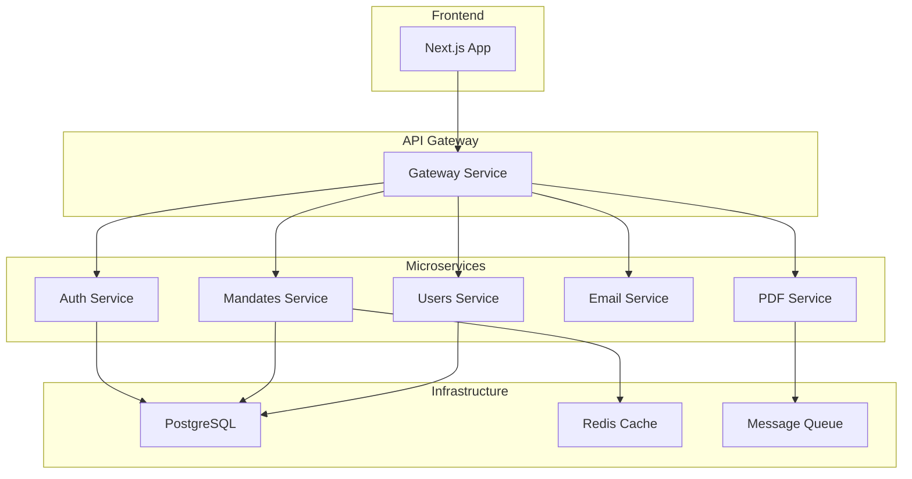

# Plan d'Amélioration CI-Mandat - Implémentation Complète

## 🎯 Objectif
Refactoriser et améliorer l'application CI-Mandat pour atteindre un niveau de qualité professionnel en matière de sécurité, performance et maintenabilité.

---

## Phase 1 : Refactoring Frontend (2-3 semaines)

### 1.1 Découper les composants volumineux

#### Dashboard (Actuel: 356 lignes → Cible: ~150 lignes)
```
Dashboard/
├── Dashboard.tsx (50 lignes) - Conteneur principal
├── StatisticsCards.tsx (40 lignes) - Cartes de statistiques
├── RecentRequestsList.tsx (45 lignes) - Liste des demandes
└── DashboardLoading.tsx (15 lignes) - État de chargement
```

#### RequestsManagement (Actuel: 854 lignes → Cible: ~300 lignes)
```
RequestsManagement/
├── RequestsManagement.tsx (60 lignes) - Conteneur principal
├── RequestsFilters.tsx (50 lignes) - Barre de filtres
├── RequestsTable.tsx (80 lignes) - Tableau des demandes
├── RequestActions.tsx (60 lignes) - Boutons d'action
├── Pagination.tsx (30 lignes) - Pagination améliorée
└── RequestRow.tsx (20 lignes) - Ligne individuelle
```

### 1.2 Créer une architecture modulaire

#### Structure des dossiers
```
src/
├── components/
│   ├── admin/
│   │   ├── dashboard/
│   │   │   ├── Dashboard.tsx
│   │   │   ├── StatisticsCards.tsx
│   │   │   ├── RecentRequestsList.tsx
│   │   │   └── DashboardLoading.tsx
│   │   ├── requests/
│   │   │   ├── RequestsManagement.tsx
│   │   │   ├── RequestsFilters.tsx
│   │   │   ├── RequestsTable.tsx
│   │   │   ├── RequestActions.tsx
│   │   │   ├── Pagination.tsx
│   │   │   └── RequestRow.tsx
│   │   └── users/
│   │       ├── UsersManagement.tsx
│   │       ├── UsersFilters.tsx
│   │       └── UsersTable.tsx
```

### 1.3 Séparer la logique métier de l'UI

#### Hooks personnalisés à créer
```typescript
// src/hooks/useMandates.ts
export const useMandates = () => {
  // Logique de gestion des mandats
}

// src/hooks/usePagination.ts
export const usePagination = () => {
  // Logique de pagination avancée
}

// src/hooks/useDashboard.ts
export const useDashboard = () => {
  // Logique des données dashboard
}

// src/hooks/useApiCache.ts
export const useApiCache = () => {
  // Gestion du cache API
}
```

### 1.4 Implémenter des hooks personnalisés

#### useMandates Hook
```typescript
interface UseMandatesReturn {
  mandates: Mandate[];
  loading: boolean;
  error: string | null;
  loadMandates: (filters?: MandateFilters) => Promise<void>;
  validateMandate: (id: string) => Promise<void>;
  rejectMandate: (id: string, reason: string) => Promise<void>;
  deleteMandate: (id: string) => Promise<void>;
}

export const useMandates = (): UseMandatesReturn => {
  // Implémentation complète
}
```

---

## Phase 2 : Améliorer la gestion d'état (1-2 semaines)

### 2.1 Compléter l'implémentation Zustand

#### Mandate Store (compléter [`src/stores/mandate.store.ts`](src/stores/mandate.store.ts))
```typescript
interface MandateStore {
  // State existant
  mandates: StoreMandate[];
  selectedMandate: StoreMandate | null;
  loading: boolean;
  error: string | null;
  filters: MandateFilters;
  totalPages: number;
  totalItems: number;

  // Actions à implémenter
  loadMandate: (id: string) => Promise<void>;
  createMandate: (data: CreateMandateData) => Promise<void>;
  updateMandate: (id: string, data: Partial<Mandate>) => Promise<void>;
  clearCache: () => void;
  setLoading: (loading: boolean) => void;
}
```

#### User Store (créer [`src/stores/user.store.ts`](src/stores/user.store.ts))
```typescript
interface UserStore {
  users: User[];
  currentUser: User | null;
  loading: boolean;
  error: string | null;
  
  loadUsers: (filters?: UserFilters) => Promise<void>;
  loadCurrentUser: () => Promise<void>;
  createUser: (userData: CreateUserData) => Promise<void>;
  updateUser: (id: string, userData: UpdateUserData) => Promise<void>;
  deleteUser: (id: string) => Promise<void>;
  resetPassword: (id: string, newPassword: string) => Promise<void>;
}
```

#### Dashboard Store (compléter [`src/stores/dashboard.store.ts`](src/stores/dashboard.store.ts))
```typescript
interface DashboardStore {
  stats: DashboardStats;
  recentRequests: RecentRequest[];
  loading: boolean;
  error: string | null;
  
  loadDashboardData: (forceRefresh?: boolean) => Promise<void>;
  refreshData: () => Promise<void>;
  clearError: () => void;
}
```

### 2.2 Centraliser la gestion des erreurs

#### Error Boundary Component
```typescript
// src/components/common/ErrorBoundary.tsx
class ErrorBoundary extends React.Component {
  componentDidCatch(error: Error, errorInfo: React.ErrorInfo) {
    // Log l'erreur
    // Afficher un message d'erreur utilisateur
  }
}
```

#### Error Handling Hook
```typescript
// src/hooks/useErrorHandler.ts
export const useErrorHandler = () => {
  const handleApiError = (error: unknown) => {
    // Gestion centralisée des erreurs API
  };
  
  const handleNetworkError = (error: unknown) => {
    // Gestion des erreurs réseau
  };
  
  return { handleApiError, handleNetworkError };
};
```

### 2.3 Implémenter le cache API

#### Cache Service
```typescript
// src/services/cache.service.ts
interface CacheService {
  get<T>(key: string): T | null;
  set<T>(key: string, value: T, ttl?: number): void;
  delete(key: string): void;
  clear(): void;
  has(key: string): boolean;
}

// Implémentation avec localStorage/sessionStorage
```

#### API Client avec Cache
```typescript
// src/lib/api-cache.ts
export const apiClientWithCache = {
  async getMandates(filters: MandateFilters) {
    const cacheKey = `mandates-${JSON.stringify(filters)}`;
    const cached = cacheService.get(cacheKey);
    
    if (cached) return cached;
    
    const data = await apiClient.getMandates(filters);
    cacheService.set(cacheKey, data, 5 * 60 * 1000); // 5 minutes
    return data;
  }
};
```

---

## Phase 3 : Robustesse Production (1-2 semaines)

### 3.1 Renforcer la base de données

#### Implémenter les migrations structurées
```sql
-- database/migrations/001_create_mandates_table.sql
CREATE TABLE mandates (
  -- Structure existante avec améliorations
);

-- database/migrations/002_add_missing_indexes.sql
CREATE INDEX CONCURRENTLY idx_mandates_form_data_email 
ON mandates USING gin ((form_data->>'email'));

CREATE INDEX CONCURRENTLY idx_mandates_created_at_status 
ON mandates(created_at, status);
```

#### Ajouter les index manquants
```sql
-- Performance des recherches
CREATE INDEX idx_mandates_form_data_search 
ON mandates USING gin (form_data);

-- Performance des statistiques
CREATE INDEX idx_mandates_status_created_at 
ON mandates(status, created_at);

-- Performance des rapports
CREATE INDEX idx_mandates_admin_approved_at 
ON mandates(admin_approved_at) 
WHERE admin_approved_at IS NOT NULL;
```

#### Configurer les sauvegardes automatiques
```yaml
# docker-compose.backup.yml
version: '3.8'
services:
  postgres-backup:
    image: prodrigestivill/postgres-backup-local
    environment:
      - POSTGRES_HOST=postgres
      - POSTGRES_DB=ci_mandat_db
      - POSTGRES_USER=ci_mandat_user
      - POSTGRES_PASSWORD=ci_mandat_password_2024
      - SCHEDULE=@daily
      - BACKUP_KEEP_DAYS=7
    volumes:
      - ./backups:/backups
    depends_on:
      - postgres
```

### 3.2 Améliorer le monitoring

#### Ajouter les métriques business
```typescript
// src/services/metrics.service.ts
interface MetricsService {
  trackMandateCreated(mandate: Mandate): void;
  trackMandateValidated(mandate: Mandate, validator: User): void;
  trackMandateRejected(mandate: Mandate, reason: string): void;
  trackUserActivity(user: User, action: string): void;
  getBusinessMetrics(): Promise<BusinessMetrics>;
}

export interface BusinessMetrics {
  totalMandates: number;
  approvalRate: number;
  averageProcessingTime: number;
  departmentStats: DepartmentStat[];
  userActivity: UserActivity[];
}
```

#### Implémenter les alertes automatiques
```typescript
// src/services/alert.service.ts
interface AlertService {
  // Alertes de sécurité
  alertFailedLoginAttempts(user: User, attempts: number): void;
  alertSuspiciousActivity(user: User, activity: string): void;
  
  // Alertes métier
  alertPendingMandates(count: number): void;
  alertSystemErrors(error: Error): void;
  
  // Alertes performance
  alertSlowResponseTimes(endpoint: string, duration: number): void;
  alertHighMemoryUsage(usage: number): void;
}
```

#### Créer des tableaux de bord de monitoring
```typescript
// src/components/admin/monitoring/MonitoringDashboard.tsx
const MonitoringDashboard = () => {
  return (
    <div className="space-y-6">
      <SystemMetrics />
      <BusinessMetrics />
      <SecurityAlerts />
      <PerformanceCharts />
    </div>
  );
};
```

---

## Phase 4 : Évolutivité (Long terme)

### 4.1 Documentation API avec Swagger/OpenAPI

#### Configuration Swagger
```typescript
// backend/src/main.ts
const config = new DocumentBuilder()
  .setTitle('CI-Mandat API')
  .setDescription('API pour la gestion des mandats électoraux')
  .setVersion('1.0')
  .addBearerAuth()
  .build();

const document = SwaggerModule.createDocument(app, config);
SwaggerModule.setup('api/docs', app, document);
```

#### Exemple de documentation
```typescript
// backend/src/modules/mandates/mandates.controller.ts
@ApiTags('mandates')
@Controller('mandates')
export class MandatesController {
  @Get()
  @ApiOperation({ summary: 'Récupérer la liste des mandats' })
  @ApiResponse({ 
    status: 200, 
    description: 'Liste des mandats récupérée avec succès',
    type: [Mandate]
  })
  async findAll(@Query() filters: MandateFiltersDto) {
    return this.mandatesService.findAll(filters);
  }
}
```

### 4.2 Tests E2E complets

#### Structure des tests E2E
```
backend/test/e2e/
├── auth.e2e-spec.ts
├── mandates.e2e-spec.ts
├── users.e2e-spec.ts
└── pdf.e2e-spec.ts
```

#### Exemple de test E2E
```typescript
// backend/test/e2e/mandates.e2e-spec.ts
describe('Mandates E2E', () => {
  let app: INestApplication;
  let authToken: string;

  beforeAll(async () => {
    const moduleFixture = await Test.createTestingModule({
      imports: [AppModule],
    }).compile();

    app = moduleFixture.createNestApplication();
    await app.init();

    // Authentification
    const loginResponse = await request(app.getHttpServer())
      .post('/auth/login')
      .send({ email: 'admin@ci-mandat.com', password: 'admin123' });
    
    authToken = loginResponse.body.access_token;
  });

  it('should create a mandate', async () => {
    const response = await request(app.getHttpServer())
      .post('/mandates')
      .set('Authorization', `Bearer ${authToken}`)
      .send({
        nom: 'Doe',
        prenom: 'John',
        email: 'john.doe@example.com',
        telephone: '+1234567890',
        circonscription: 'KATIOLA'
      })
      .expect(201);

    expect(response.body).toHaveProperty('id');
    expect(response.body.formData.nom).toBe('Doe');
  });
});
```

### 4.3 CI/CD automatisé

#### GitHub Actions Workflow
```yaml
# .github/workflows/ci-cd.yml
name: CI/CD Pipeline

on:
  push:
    branches: [ main, develop ]
  pull_request:
    branches: [ main ]

jobs:
  test:
    runs-on: ubuntu-latest
    steps:
      - uses: actions/checkout@v3
      - uses: actions/setup-node@v3
        with:
          node-version: '18'
      
      - name: Install dependencies
        run: |
          npm ci
          cd backend && npm ci
      
      - name: Run tests
        run: |
          cd backend && npm test
          npm run test:cov
      
      - name: Build application
        run: |
          npm run build
          cd backend && npm run build

  deploy:
    needs: test
    runs-on: ubuntu-latest
    if: github.ref == 'refs/heads/main'
    
    steps:
      - uses: actions/checkout@v3
      - name: Deploy to production
        run: |
          docker-compose -f docker-compose.production.yml up -d
```

### 4.4 Microservices pour la scalabilité

#### Architecture cible


#### Service de mandats indépendant
```typescript
// services/mandates-service/src/main.ts
@Module({
  imports: [
    TypeOrmModule.forRoot(typeOrmConfig),
    MandatesModule,
  ],
})
export class MandatesServiceApp {}

// Démarrer sur le port 3002
```

---

## 📅 Timeline d'Implémentation

### Semaine 1-2 : Refactoring Frontend
- [ ] Découper les composants Dashboard
- [ ] Découper les composants RequestsManagement  
- [ ] Créer l'architecture modulaire
- [ ] Implémenter les hooks personnalisés

### Semaine 3-4 : Gestion d'État
- [ ] Compléter les stores Zustand
- [ ] Centraliser la gestion des erreurs
- [ ] Implémenter le cache API
- [ ] Tests des nouvelles fonctionnalités

### Semaine 5-6 : Robustesse Production
- [ ] Implémenter les migrations de base de données
- [ ] Ajouter les index manquants
- [ ] Configurer les sauvegardes
- [ ] Implémenter le monitoring

### Semaine 7-8 : Évolutivité
- [ ] Documentation API Swagger
- [ ] Tests E2E complets
- [ ] Pipeline CI/CD
- [ ] Préparation microservices

## 🎯 Métriques de Succès

### Performance
- **Temps de chargement** : < 2 secondes
- **Taille bundle** : < 300KB
- **Mémoire utilisée** : < 100MB

### Qualité
- **Couverture de tests** : > 80%
- **Complexité cyclomatique** : < 10 par composant
- **Lignes de code** : < 200 par composant

### Métier
- **Taux de conversion** : > 90%
- **Temps de traitement moyen** : < 24h
- **Satisfaction utilisateur** : > 4.5/5

---

*Ce plan sera mis à jour régulièrement pendant l'implémentation.*